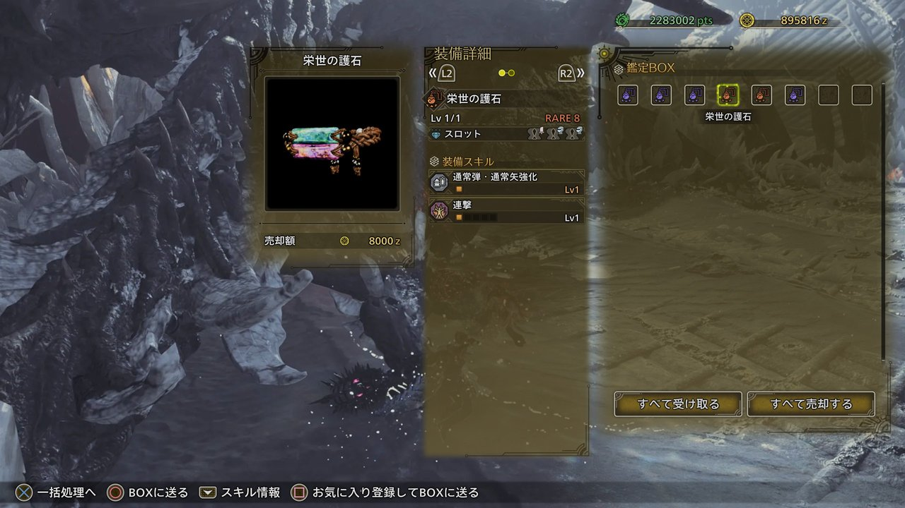
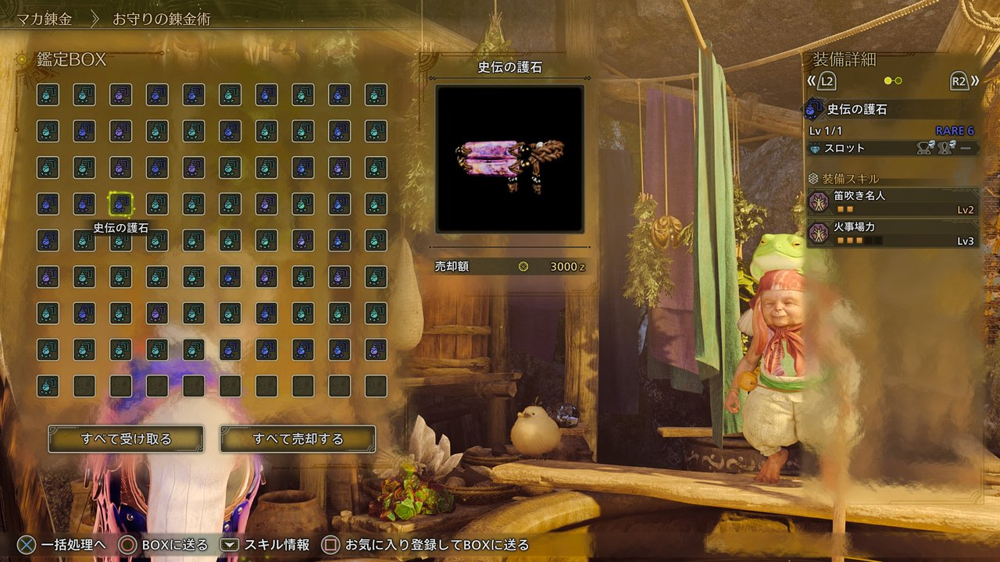
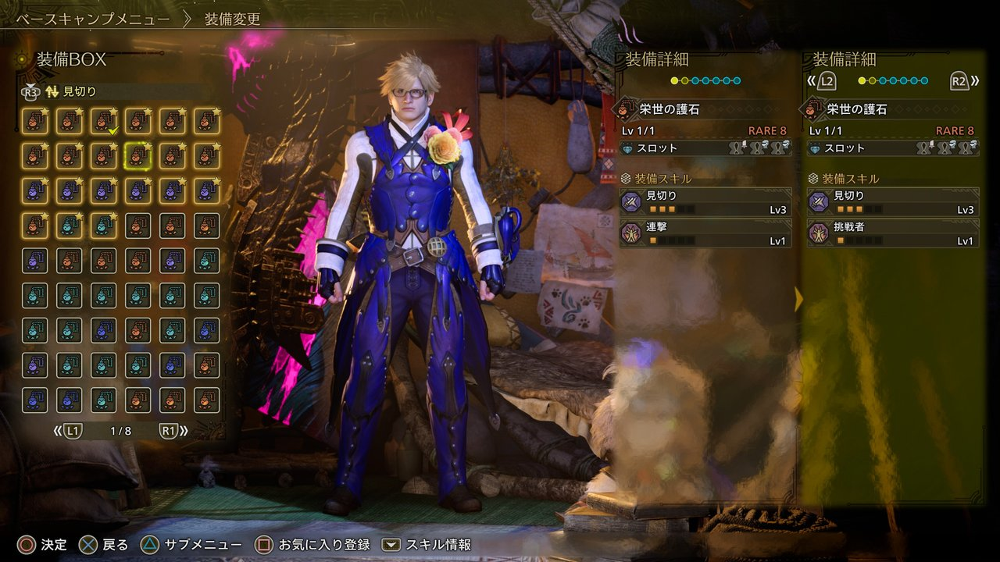
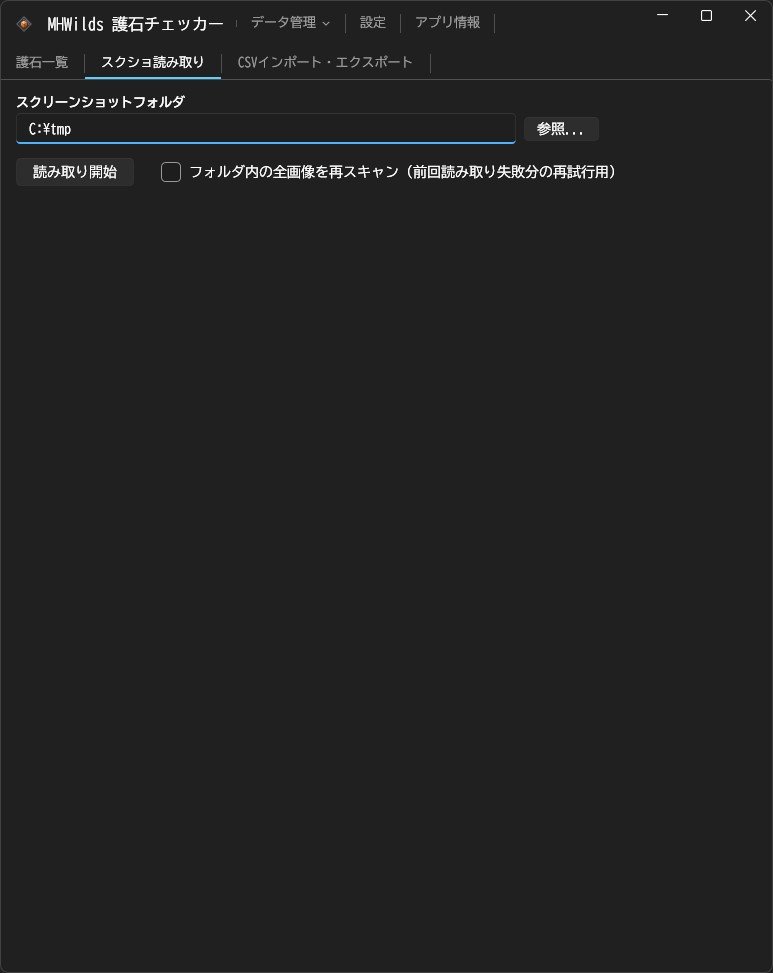
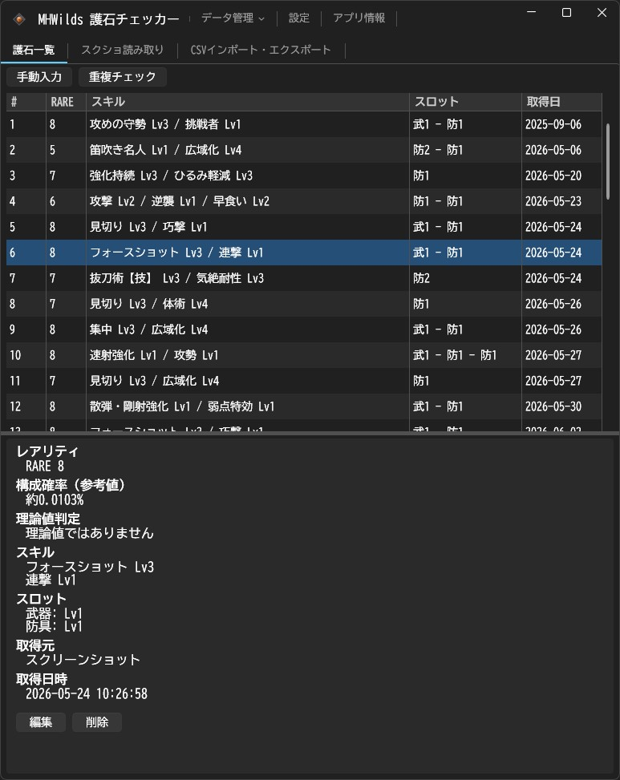
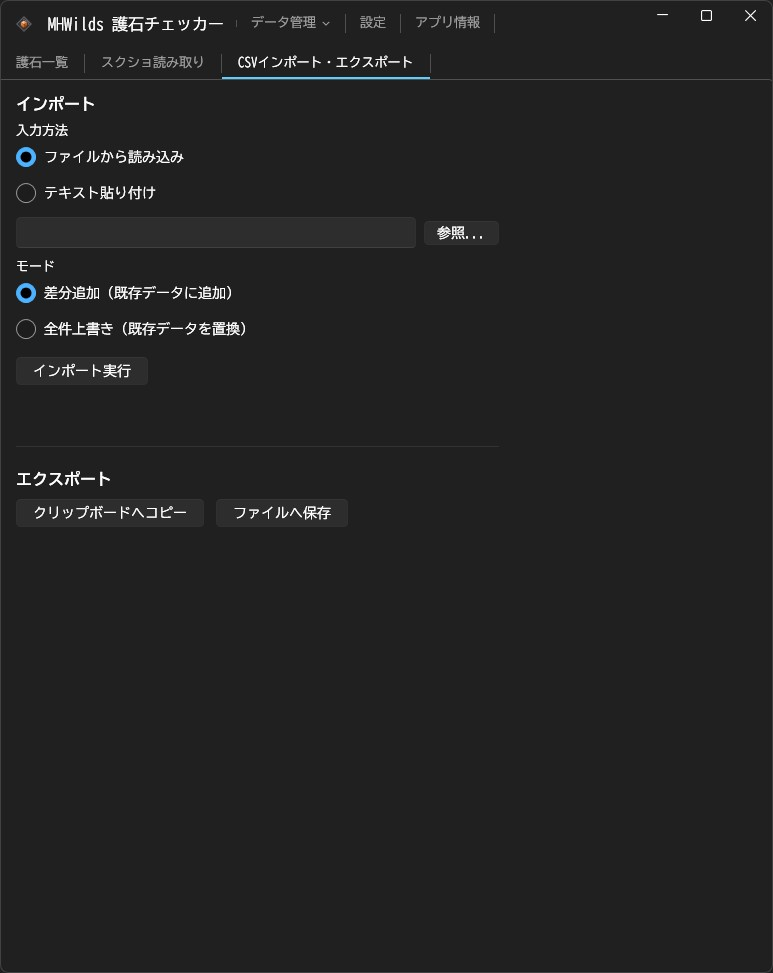

# MHWilds 護石チェッカー

*A tool for the Japanese version of Monster Hunter Wilds.*

[モンスターハンターワイルズ](https://www.monsterhunter.com/wilds/ja-jp/)の護石（スキル構成・スロット情報）を管理するための、Windows専用のデスクトップアプリです。護石鑑定画面のスクリーンショットから読み取ったデータと、[MH Wildsスキルシミュ(泣)](https://mhwilds.wiki-db.com/sim/)（以下「泣シミュ」）のCSVデータを1つのリストにまとめて管理できます。重複している護石や下位互換の護石を見つけて整理したあと、泣シミュへCSVとして書き戻すこともできます。手元のスクリーンショットとブラウザ上の泣シミュをつなぐ、橋渡し役のツールです。文字の読み取り（OCR）・画像処理・データの照合はすべてお使いのPCの中で完結し、スクリーンショットや読み取り結果を外部へ送信することはありません。

## 動作環境・前提条件

- Windows 11（動作を確認しているのは日本語版のWindows 11のみです。Windows 10での動作は確認していません）
- モンスターハンターワイルズ 日本語版のスクリーンショット（護石の詳細画面・比較画面）
- 日本語のOCR言語パック（Windowsの「言語と地域」の設定で、日本語のオプション機能として追加してください。入っていない場合、文字の読み取りに失敗します）
- 動作を確認している解像度は2560×1440（16:9）です。3440×1440（21:9ネイティブ、ウルトラワイド）も一部の画面で確認しています。それ以外の解像度・アスペクト比では動作を確認していません。
- アプリは、実行ファイルと同じフォルダに護石データ（`charms.json`）・設定（`settings.json`）・エラーログ（`error.log`）を保存します。書き込みができる場所に置いて実行してください。

## 現在の配布状況

Windows x64向けの自己完結（self-contained）ポータブルzipを、[GitHub Releases](https://github.com/tricksterzero/MHWildsCharmChecker/releases)で配布しています。.NETランタイムを別途インストールする必要はなく、zipを展開して`MHWildsCharmChecker.exe`を起動するだけで使えます。

## 使い方

### 想定する使い方

大きく分けて、次の3つの使い方を想定しています。

1. **護石鑑定画面からの取り込み**（狩猟後の護石入手画面・マカ錬金後の護石鑑定画面のどちらでも同じ手順です）
   1. 護石を鑑定した直後、「お気に入りに登録してBOXに送る」操作をする**前**に、装備詳細が見える状態でスクリーンショットを撮ります
   2. 好きなタイミングで、「スクショ読み取り」タブからまとめて取り込みます
   3. 「護石一覧」タブの重複チェック機能で整理します
   4. 「CSVインポート・エクスポート」タブから泣シミュ形式でエクスポートし、泣シミュへインポートします

   狩猟後の護石入手画面の例:

   

   マカ錬金後の護石鑑定画面の例:

   
2. **泣シミュの既存データからのインポート**
   1. 泣シミュの「鑑定護石」タブの下のほうにある「お守りコピペ インポート/エクスポート」でエクスポートします
   2. 表示されたCSVをコピーし、「CSVインポート・エクスポート」タブからインポートします
   3. 「護石一覧」タブの重複チェック機能で整理します
   4. もう一度CSVをエクスポートし、泣シミュへ書き戻します
3. **装備画面の護石スクリーンショットからの取り込み**（補助的な使い方）: 装備画面では、現在装備している護石と装備先の護石が左右に並びます。このうち右側の装備先の護石も、スクリーンショットから読み取れます。護石を鑑定したときにスクリーンショットを撮り忘れた場合の補完手段としてお使いください。

   装備画面の例:

   

### 各タブの機能

アプリは3つのタブで構成されています。

1. **スクショ読み取りタブ**: 護石のスクリーンショットが入ったフォルダを指定し、「読み取り開始」でまとめて読み取ります。前回までに読み取ったファイルは自動的にスキップされます（差分読み込み）。読み取りに失敗したファイルをもう一度試したいときは、「フォルダ内の全画像を再スキャン」にチェックを入れてから実行してください。読み取った結果は一覧で確認でき、内容を確かめてから「全件を護石一覧に追加」を押すと護石一覧タブに反映されます。

   
2. **護石一覧タブ**: 読み取った護石や登録した護石を一覧で表示します。「重複チェック」ボタンで、完全に同じ護石や上位互換の護石を見つけられます。内容を直接編集したいときは「編集」ボタンから、新しく手入力したいときは「手動入力」ボタンから行えます。詳細パネルには「構成確率（参考値）」として、そのスキル・スロット構成がそのレアリティの中でどのくらいの確率で選ばれるかの推定値を表示します（推定の前提は「既知の制約」にまとめています）。あわせて「理論値判定」で、その護石が理論上の最大構成かどうかを判定します。スキルについては、各スキルがそのスキル自身の最大Lvになっているかを見ます。スロットについては、同じスキル構成を共有するレアリティの中で、他のどのパターンにも上回られない構成になっているかを見ます。

   
3. **CSVインポート・エクスポートタブ**: 護石データをCSV形式のファイルで入出力したり、テキストを貼り付けてインポートしたりできます（形式は下の「CSV形式」で説明しています）。

   

タイトルバーの「データ管理」からは、ローカルデータ（アプリ内部の形式）のエクスポート・インポート・初期化ができます。「設定」ではスクリーンショットのフォルダとテーマを設定できます。テーマは「Windowsの設定に合わせる」「ライト」「ダーク」から選べ、最初は「Windowsの設定に合わせる」になっています。「アプリ情報」ではバージョンや使用しているライブラリを確認できます。「データ管理」「設定」「アプリ情報」は、それぞれAlt+D／Alt+S／Alt+Aのキー操作でも開けます。

OCR・スロットの判定は自動で行っているため、**読み取り結果に誤りが含まれることがあります**。護石一覧タブで内容を確認するか、重複チェックの結果を確認していただくことをおすすめします。

## CSV形式

このツールが入出力するCSVは、[MH Wildsスキルシミュ(泣)](https://mhwilds.wiki-db.com/sim/)と相互にやり取りできることを目指した形式です。ただし、**完全な互換性を保証するものではありません**。

## 既知の制約

- 動作を確認したゲームのバージョンはVer.1.041.03.00です。
- 対象は日本語版のゲーム画面のみです。
- OCR・画像処理による自動判定のため、スキル名・Lv・レアリティ・スロット構成のいずれも読み取りを間違えることがあります。特に、ゲームの表示言語・解像度・アスペクト比が確認環境と異なる場合や、スクリーンショットが圧縮されていて画質が低い場合に、誤判定が起こりやすくなります。
- 読み取れるのは、護石の詳細画面・比較画面のみです。2つの護石を比較する画面では、右側（BOX候補側）のパネルだけが対象で、左側（現在装備中の護石）は対象外です。
- 護石のスロットに装飾品が付いている場合、そのスロットを正しく読み取れないため、その護石全体を読み取りの対象から外します（間違った内容で読み取られることはなく、読み取り結果には含まれません）。鑑定した直後の護石には通常装飾品が付いていないため、実際に困ることは少ないと思いますが、すでに装備・カスタマイズ済みの護石をスクリーンショットから取り込む場合はご注意ください。
- 武器スロットのLv2・Lv3は現在のゲームには存在しないため、対応していません（今後のアップデートで追加された場合は、確認したうえで、可能であれば対応する予定です）。
- 「穴なし」スロット（ショップで購入する護石にのみあるもの）は対象外です。
- 「構成確率（参考値）」は、スキルの組み合わせ・スロットのパターン・個々のスキルがどれも等確率で選ばれるという、確かめられていない仮定に基づく推定値です（RARE8のスロット確率だけは、有志の方によるゲーム内データの解析に基づく実測値を使っています）。実際のゲーム内の抽選確率を保証するものではありません。
- 「理論値判定」のスロットの条件では、同じスキルグループ構成を共有するレアリティの間でだけスロットを比較しています。たとえばRARE7とRARE8は同じスキル構成を共有するため、比較の対象になります。一方で、防具スロットと武器スロットは種類が違って単純に比べられないため、関係のない組み合わせとは比較しません。

## フィードバック・不具合報告

不具合の報告や要望は、次のいずれかまでお気軽にお寄せください。

- 作者へのメール: [mail@tszero.jp](mailto:mail@tszero.jp)
- [このリポジトリのIssues](https://github.com/tricksterzero/MHWildsCharmChecker/issues)
- [作者のX（Twitter）アカウント](https://x.com/tsZ)

## 免責・帰属表示

このツールは、カプコンが権利を持つ「モンスターハンターワイルズ」に関連する非公式のファンツールです。カプコンおよび同社の関連会社とは一切関係がなく、公式に承認されたものでもありません。ゲーム内の画像・名称などの知的財産権は、すべてカプコンに帰属します。

## ライセンス

このツール自体は[MIT License](LICENSE)のもとで公開しています。使用しているサードパーティライブラリのライセンス表示は、[THIRD-PARTY-NOTICES](THIRD-PARTY-NOTICES)をご覧ください。

## 開発者向け情報

### 動作環境

- .NET 10 SDK
- Windows（`Windows.Media.Ocr`を使っているため、ビルド・実行ともにWindows専用です）

### ビルド方法

.NET 10 SDKをインストールしたうえで、リポジトリの直下から次のコマンドを実行してください。

```
dotnet build app/CharmChecker.App
dotnet run --project app/CharmChecker.App
dotnet test app/CharmChecker.Tests
```

### CSV形式の詳細

- ヘッダー行はありません。1行が護石1個です
- 12列のカンマ区切りです: `スキル1名,Lv,スキル2名,Lv,スキル3名,Lv,防具スロット1,防具スロット2,防具スロット3,武器スロット1,武器スロット2,武器スロット3`
- スキルが3つ未満の場合、空いている分は名前を空欄、Lvを`0`にします
- スロットは各位置のレベルを`0`〜`3`で記録します（穴なしは`0`）
